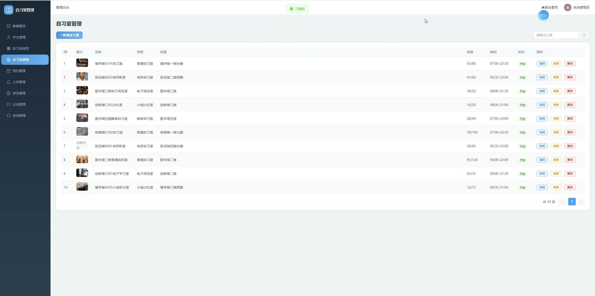
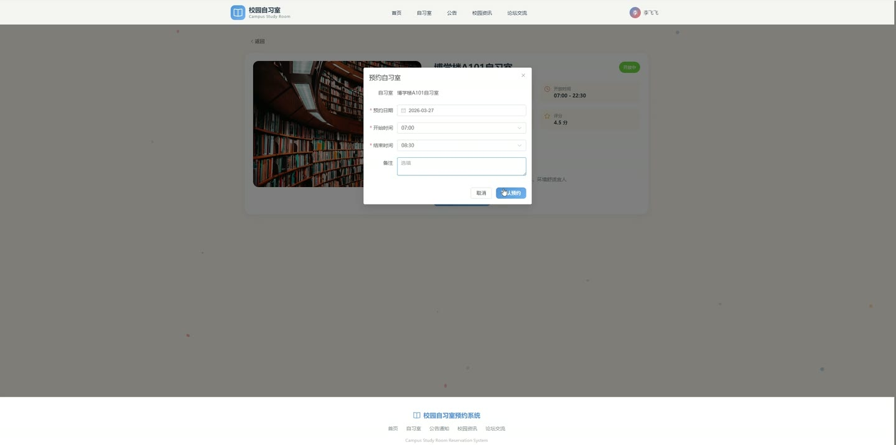
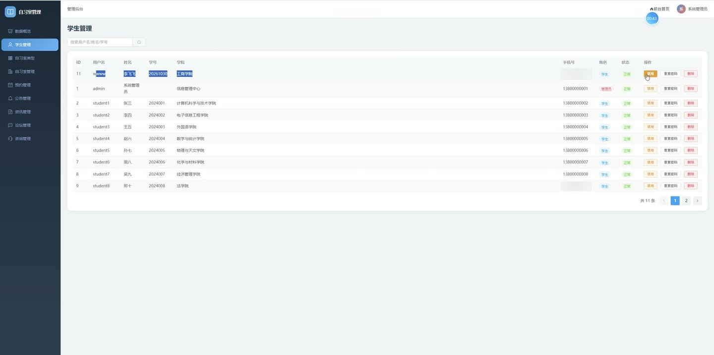
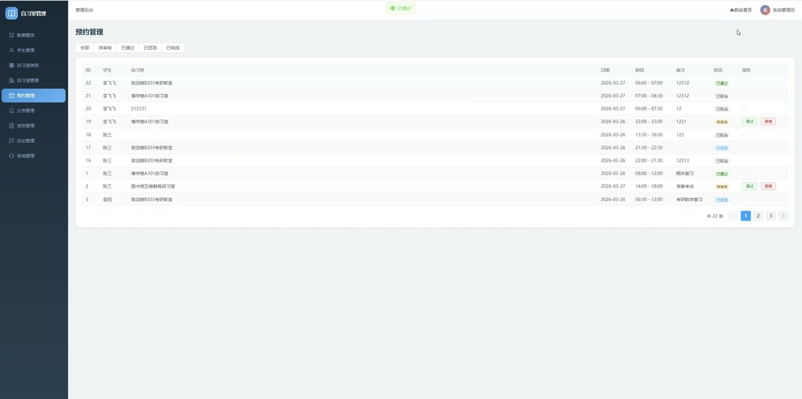

# (附文档)Springboot3+Vue3+MySQL 校园自习室预约系统

**技术栈**：Springboot3、Vue3、MySQL

### 系统简介

本系统为一套基于 Spring Boot 3 + Vue 3 + MySQL 的校园自习室预约管理平台，采用前后端分离架构。系统包含普通用户端和管理员端两个角色，提供自习室浏览与预约、在线咨询、论坛交流、公告与资讯查看、个人中心等功能；管理员可进行自习室与类型管理、预约审核、用户管理、内容管理及数据统计，满足校园自习室的日常运营与监管需求。
 
### 核心功能
 
### 普通用户端

 
- 注册新账号（设置用户名、密码、真实姓名、学号、学院等信息，注册后自动赋予学生角色） 
- 登录系统（输入用户名与密码，校验账号状态与密码，登录后获取 JWT Token 并返回用户信息） 
- 查看自习室列表（支持按自习室名称/位置关键词搜索，按自习室类型筛选，分页展示） 
- 查看自习室详情（展示自习室名称、类型、位置、容量、当前可用座位、开放时间、设施描述、评分等） 
- 提交预约申请（选择自习室、预约日期、开始时间与结束时间，填写备注，提交后可用座位数自动减一） 
- 查看我的预约列表（按预约状态筛选，分页展示所有预约记录，包含自习室名称、位置、预约时间、状态等） 
- 取消预约（仅待审核或已通过的预约可取消，取消后自动恢复对应自习室可用座位数） 
- 签到操作（已通过审核的预约可进行签到，签到后状态变为已签到） 
- 查看公告列表（分页展示已发布的公告，支持置顶排序，查看公告详情） 
- 查看资讯列表（分页展示已发布的资讯，支持搜索标题，查看资讯详情并自动增加阅读量） 
- 浏览论坛帖子列表（分页展示已发布的帖子，支持按标题搜索，查看帖子详情并自动增加浏览量） 
- 发布论坛帖子（填写标题与内容，发布后状态默认为正常） 
- 为帖子点赞（点赞数自动加一） 
- 查看帖子评论列表（按时间升序展示，显示评论者姓名与头像） 
- 发表帖子评论（填写评论内容，发布后状态默认为正常） 
- 发起在线咨询（填写咨询标题与内容，系统自动创建咨询会话并发送第一条消息） 
- 查看我的咨询列表（分页展示所有咨询记录，显示最新消息与最后更新时间） 
- 发送咨询消息（在指定咨询会话中发送文本消息，消息内容不可为空） 
- 查看咨询消息记录（按时间升序展示会话内所有消息，显示发送者姓名） 
- 查看推荐自习室（基于协同过滤算法，根据用户预约行为推荐相似用户预约过的自习室，未登录时按评分推荐前6个） 
- 查看自习室类型列表（获取所有自习室类型，用于首页分类展示） 
- 修改个人资料（更新真实姓名、头像、手机号、邮箱、学号、学院等信息） 
- 修改个人密码（输入原密码与新密码，校验原密码正确后更新） 
- 查看个人信息（获取当前登录用户的详细信息） 
- 文件上传（上传头像或封面图片，返回可访问的 URL 地址）
 
### 管理员端

 
- 仪表盘总览（展示学生用户总数、自习室总数、开放自习室数、总预约数、待审核预约数、今日预约数、咨询总数、帖子总数、总座位容量、当前可用座位、整体利用率） 
- 自习室利用率统计（按自习室展示容量、已使用座位、可用座位及利用率百分比） 
- 预约状态分布统计（按待审核、已通过、已拒绝、已取消、已签到、已完成状态分别统计预约数量） 
- 预约趋势统计（展示近7天每日预约数量变化趋势） 
- 自习室类型预约统计（按类型统计预约总数、房间数量与总容量） 
- 学院分布统计（按学院统计学生用户数量） 
- 高峰时段统计（按小时统计预约开始时间分布，展示6:00至23:00各时段预约量） 
- 用户管理（分页查询用户列表，支持按用户名/真实姓名/学号搜索） 
- 编辑用户信息（修改用户真实姓名、手机号、邮箱、学号、学院等信息） 
- 启用/禁用用户账号（切换账号状态，禁用后用户无法登录） 
- 重置用户密码（将指定用户密码重置为 123456） 
- 删除用户（从系统中移除指定用户） 
- 自习室管理（分页查询自习室列表，支持按名称/位置关键词和类型筛选） 
- 新增自习室（填写名称、类型、位置、容量、开放时间、关闭时间、设施描述、评分等，可用座位默认等于容量） 
- 编辑自习室信息（修改自习室所有字段） 
- 启用/关闭自习室（切换自习室状态，关闭后用户无法预约） 
- 删除自习室（从系统中移除指定自习室） 
- 自习室类型管理（查看所有类型列表） 
- 新增自习室类型（填写类型名称、描述、图标） 
- 编辑自习室类型（修改类型名称、描述、图标） 
- 删除自习室类型（从系统中移除指定类型） 
- 预约管理（分页查询所有预约记录，支持按预约状态筛选） 
- 审核预约（通过或拒绝预约申请，拒绝时自动恢复自习室可用座位数） 
- 公告管理（分页查询公告列表，支持按标题搜索） 
- 新增公告（填写标题与内容，可设置置顶与发布状态） 
- 编辑公告（修改公告标题、内容、置顶、状态） 
- 删除公告（从系统中移除指定公告） 
- 资讯管理（分页查询资讯列表，支持按标题搜索） 
- 新增资讯（填写标题、内容、封面，发布后阅读量默认为0） 
- 编辑资讯（修改资讯标题、内容、封面、状态） 
- 删除资讯（从系统中移除指定资讯） 
- 论坛管理（分页查询所有帖子，支持按标题搜索） 
- 启用/禁用帖子（切换帖子状态，禁用后前台不可见） 
- 删除帖子（从系统中移除指定帖子） 
- 删除帖子评论（从系统中移除指定评论） 
- 咨询管理（分页查询所有咨询记录，支持按状态筛选） 
- 回复咨询消息（在指定咨询会话中发送回复消息）
 
### 技术栈

 后端框架Spring Boot 3.2 ORMMyBatis-Plus 3.5.5 权限认证JWT（jjwt 0.9.1） + 自定义拦截器 密码加密Spring Security Crypto BCrypt 前端框架Vue 3 + Vite 路由Vue Router 4 构建工具Vite 数据库MySQL 8 数据库连接池HikariCP 文件上传MultipartFile + 本地存储
 
### 交付内容

 
- 后端完整源码 
- 前端完整源码 
- 数据库初始化脚本 
- 万字文档

## 界面展示

---

## 获取完整源码 + 万字文档

本仓库为项目介绍页。**完整前后端源码、数据库初始化脚本、万字项目文档**，请加微信 `kangkangcode`，或访问 [codekk.top](http://codekk.top) 获取。

可作课程设计 / 毕业设计参考，支持远程部署调试。